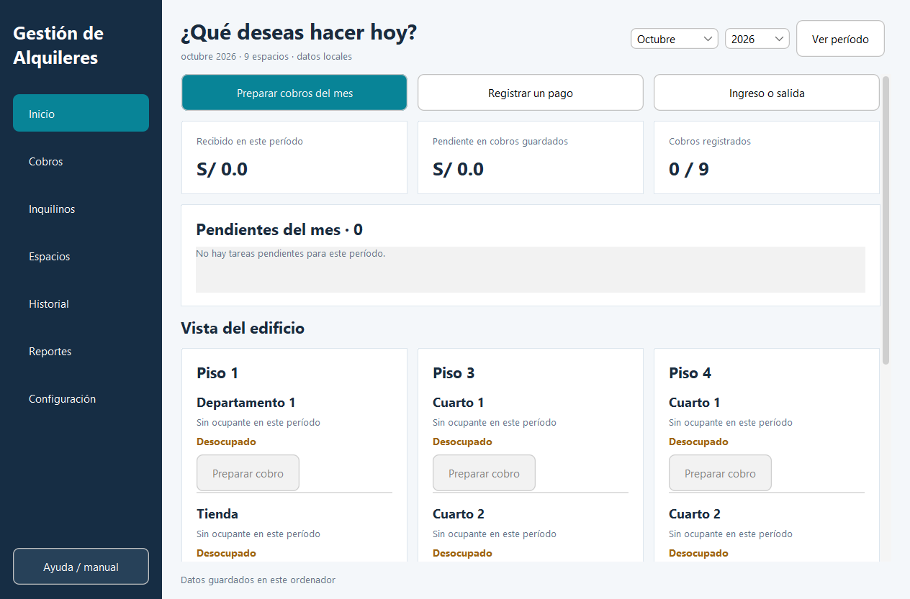

# Gestión de Alquileres

Aplicación de escritorio en Java para gestionar alquileres, inquilinos, pagos y garantías,
con almacenamiento local cifrado, documentos PDF y respaldos.

**Java 21 · Maven · Swing · FlatLaf · Gson · PDFBox · AES-256-GCM**  
Versión **1.2.3**. Proyecto de aprendizaje aplicado de un estudiante de Ingeniería de Sistemas.

## Problema y objetivo

Centralizar cobros y documentos, evitar duplicados y facilitar correcciones y recuperación.
El objetivo fue completar una solución usable, con validaciones, pruebas y documentación.

## Qué permite

- Administrar inquilinos, espacios, estancias e historial.
- Preparar cobros y registrar pagos completos, garantías y reparaciones.
- Generar avisos, recibos y liquidaciones PDF con versiones conservadas.
- Revisar pendientes, reportes y auditoría; deshacer el último cambio.
- Crear/restaurar respaldos y preparar mensajes para WhatsApp con envío manual.

## Cómo está construido

Interfaz Swing → servicio y modelo → archivos locales con Gson y AES-256-GCM.
FlatLaf aporta el estilo y PDFBox los documentos.
El cifrado protege el estado almacenado; los PDF exportados son legibles.
[Arquitectura y seguridad](docs/architecture/README.md).

## Evidencia

**185 comprobaciones de aceptación satisfactorias**, verificadas en la copia privada.
Suite propia sin JUnit. [Áreas probadas, ejecución y límites](docs/PRUEBAS.md).

[Inquilinos](docs/screenshots/inquilinos.png) · [Cobros](docs/screenshots/cobros.png) ·
[WhatsApp](docs/screenshots/whatsapp.png) · [Todas las capturas](docs/screenshots/README.md).
Son capturas reales con datos sintéticos de pruebas.

Desafíos, aprendizajes y mejoras futuras

**Desafíos:** distinguir lectura faltante de cero, evitar cobros y pagos duplicados,
conservar PDF anteriores al corregir registros y recuperar información dañada.

**Aprendizajes:** validación, importes decimales, separación de responsabilidades y procedimientos
de soporte. El proyecto combina desarrollo junior con reproducción de errores, recuperación
de datos y explicación de soluciones al usuario.

**Mejoras futuras:** CI con entorno gráfico, medición de cobertura, mayor separación de la interfaz
y pruebas del instalador en el equipo final. Son propuestas, no capacidades ya implementadas.

## Revisión técnica

El código fuente completo del proyecto se mantiene en un repositorio privado.
Puede ser mostrado o compartido para revisión técnica durante procesos de selección.
Este repositorio presenta la documentación y las capturas del proyecto; la implementación completa permanece privada.

Todos los derechos reservados sobre el material original. [Aviso de derechos](NOTICE.md).
