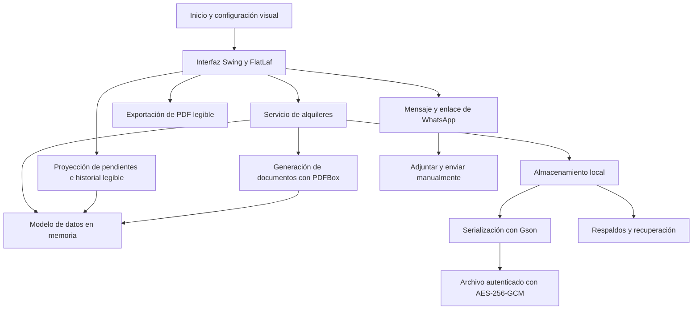

# Arquitectura · versión 1.2.3

Aplicación monolítica de escritorio, un módulo Maven y un paquete Java `pe.alquileres`.
La separación es por responsabilidad de clase, con dependencias directas; no se presenta como MVC estricto.

El modelo reúne espacios, inquilinos, estancias, cobros, garantías, reparaciones, documentos y auditoría.
Los documentos se conservan junto al estado; la exportación crea un PDF legible fuera del almacenamiento.
No hay servidor de base de datos ni backend web. La integración con WhatsApp abre un enlace;
no utiliza WhatsApp Business API ni verifica entrega o lectura.

El cifrado protege el archivo de estado y el contenido de documentos almacenados. La protección
depende de custodiar el almacenamiento y su material de recuperación. Los PDF exportados requieren
cuidado separado. El diagrama explica responsabilidades; no publica algoritmos ni formatos internos.
